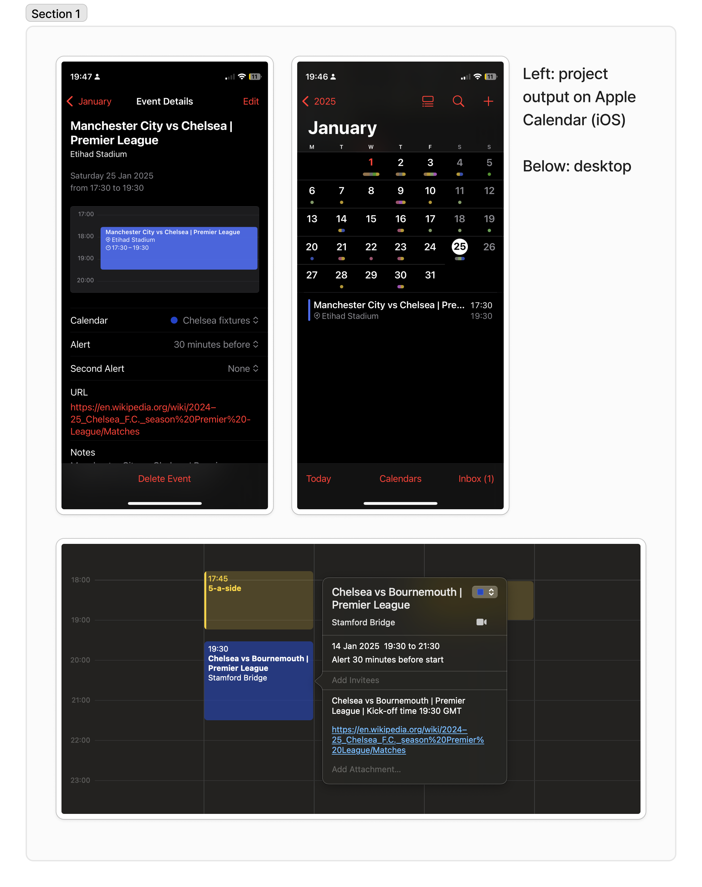

# Football fixture calendar generator

Ever booked a social/work event only to find out later that your team is playing at the same time? 

This project provides a Python script and AI prompt to generate digital calendar file type.

The flow uses Perplexity to fetch and format event data to avoid manual data entry, prior to Python script formatting `.csv` into `.ics` (iCalendar) file type for integration with any standard digital calendar application. 



### Features

- **Event data fetching**: Gathers match data and converts to parameters/columns necessary for .ics format.
- **Simple CSV to ICS Conversion**: Converts parameters such as location, start and end times, and more into a standard iCalendar file.
- **Notifications**: Integrates alarm settings, notifying users prior to match events.
- **Error Handling**: Includes error handling for missing columns or invalid data formats.

## Requirements:
- Python 3.x or higher
- `csv` and `datetime` Python modules (both are part of the standard library)
- GenAI model, to avoid manual data input

## Installation

1. Clone the repository to your local machine:
    ```bash
    git clone https://github.com/alexmcgovern14/football-fixture-calendar-generator.git
    ```

2. Navigate into the project directory:
    ```bash
    cd football-fixture-calendar-generator
    ```

## How to Run:

1. Prompt Perplexity or alternative LLM using PROMPT.md to generate .csv file in required format. 

2. Run the script:
    ```bash
    python fixtures_calendar.py
    ```

3. The output `.ics` file will be created in the same directory.

## Example CSV Format:

See fixtures_calendar.csv

## License
This project is licensed under the MIT License - see the [LICENSE](LICENSE) file for details.

## Future iteration
Dynamic data input which updates as fixtures change during season.